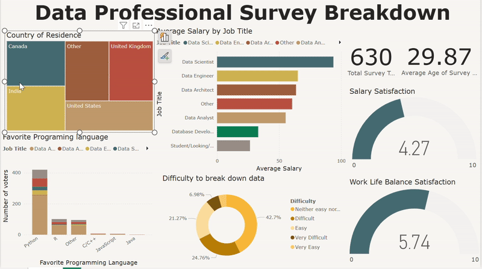

# 📊 Power BI Data Professional Survey Dashboard

## 🔍 Overview  
This project analyzes data from the **Data Professional Survey**, providing insights into industry trends, salaries, and tools used by professionals. The **Power BI dashboard** visualizes key findings, helping users explore relationships between experience, job roles, and earnings.

## 📸 Dashboard Preview  
### 📷 Static Screenshot  
  

### 🎥 Animated GIF Preview  

## 🔢 Findings & Conclusion  
### 📊 Key Findings  
- **Country Representation:** The majority of survey respondents are from the United States, India, Canada, and the UK.
- **Salary Insights:** Data Scientists have the highest average salary, followed by Data Architects and Data Engineers.
- **Programming Language Preference:** Python is the most preferred programming language, with R and SQL also being widely used.
- **Difficulty in Breaking Down Data:** Nearly 43% of professionals find it neither easy nor difficult, while about 21% struggle significantly.
- **Job Satisfaction:**  
  - Salary Satisfaction Score: 4.03/10, indicating room for improvement.
  - Work-Life Balance Satisfaction: 5.40/10, showing moderate satisfaction but potential concerns.

### 📝 Conclusion  
- Salaries vary significantly based on job role, with Data Scientists earning the highest pay.  
- Work-life balance remains a concern for professionals, as satisfaction scores indicate moderate levels of contentment.  
- Companies should focus on improving salary satisfaction and creating better work-life balance policies.  

This analysis provides valuable insights into the evolving landscape of data professionals. Companies can use these insights to **align hiring strategies**, while professionals can leverage them for **career growth and skill development**. Continuous learning in **SQL, Python, and Power BI** can significantly enhance career prospects in the data field.

## 👥 Let's Connect!  
**Email:** [Email](mailto:maryshrine18@gmail.com)  
**LinkedIn:** [LinkedIn Profile](https://www.linkedin.com/in/shrinemary-analyst/)
